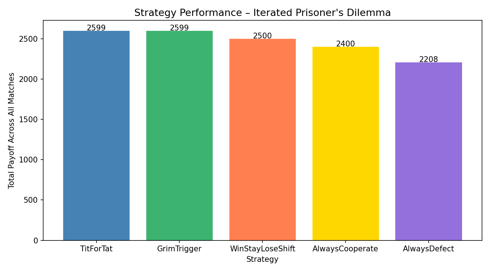
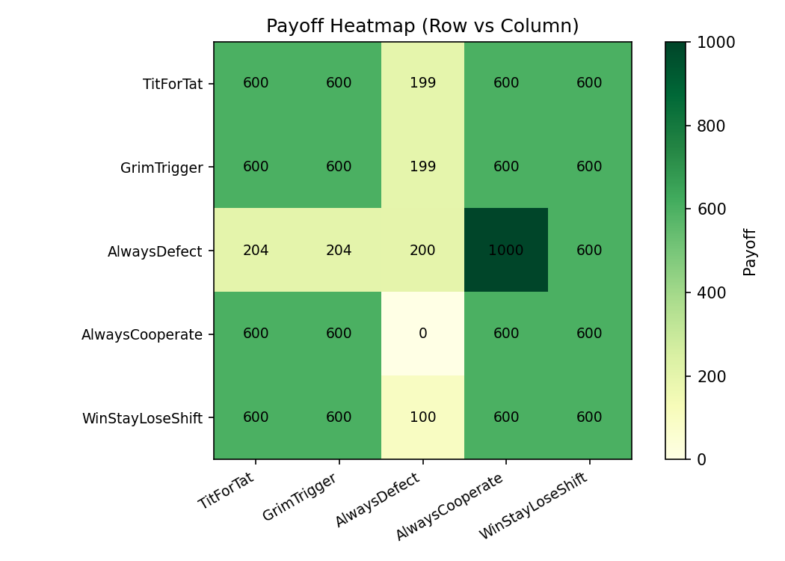
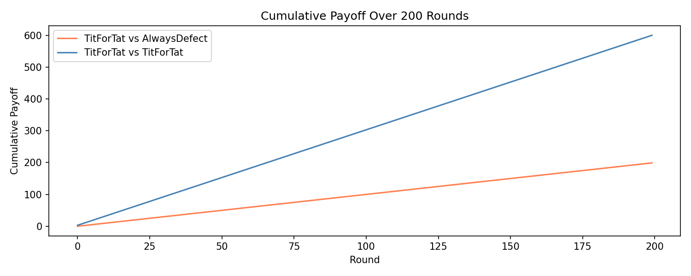
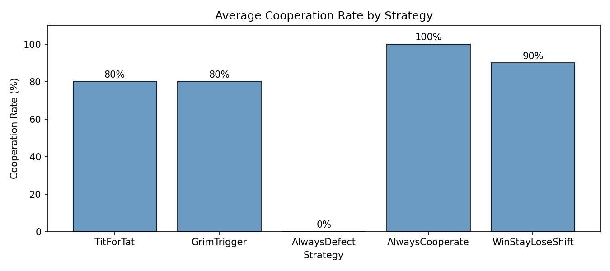
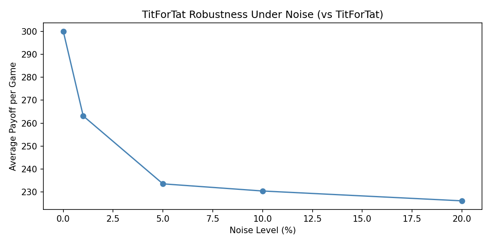

# Game Theory Strategy Simulator

A Python simulation framework for analysing **Iterated Prisoner's Dilemma** tournaments among multiple strategies. Implements classic game theory strategies, runs round-robin tournaments, and evaluates long-term payoff stability, cooperation emergence, and strategy robustness under noise.

---

## Project Structure

```
gametheorysimulator/
├── main.py
├── README.md
└── output_plots/
    ├── 1_strategy_performance.png
    ├── 2_payoff_heatmap.png
    ├── 3_cumulative_payoff.png
    ├── 4_cooperation_rates.png
    └── 5_noise_robustness.png
```

---

## The Prisoner's Dilemma

At each round, two players independently choose to **Cooperate (C)** or **Defect (D)**. Payoffs follow the standard matrix:

| Player A | Player B | A Payoff | B Payoff |
|---|---|---|---|
| C | C | 3 | 3 |
| C | D | 0 | 5 |
| D | C | 5 | 0 |
| D | D | 1 | 1 |

Mutual cooperation is collectively optimal, but individual incentives favour defection — creating the central tension the strategies must navigate.

---

## Strategies Implemented

| Strategy | Description |
|---|---|
| **Tit-for-Tat** | Cooperate on round 1; then mirror opponent's last move |
| **Grim Trigger** | Cooperate until opponent defects once; then defect forever |
| **Always Defect** | Defect unconditionally every round |
| **Always Cooperate** | Cooperate unconditionally every round |
| **Win-Stay Lose-Shift** | Repeat last move if payoff ≥ 3; otherwise switch |

---

## Tournament Results

Each strategy played every other strategy in a **200-round iterated game** (round-robin format).

### Strategy Rankings (Total Payoff)

| Rank | Strategy | Total Payoff |
|---|---|---|
| 1 | TitForTat | 2599 |
| 2 | GrimTrigger | 2599 |
| 3 | WinStayLoseShift | 2500 |
| 4 | AlwaysCooperate | 2400 |
| 5 | AlwaysDefect | 2208 |

**Key finding:** Cooperative retaliatory strategies (Tit-for-Tat, Grim Trigger) outperform pure defection in iterated settings — consistent with Nash equilibrium analysis of repeated games.

### Cooperation Rates

| Strategy | Cooperation Rate |
|---|---|
| AlwaysCooperate | 100% |
| WinStayLoseShift | 90% |
| TitForTat | 80% |
| GrimTrigger | 80% |
| AlwaysDefect | 0% |

### Full Payoff Table

```
                  TitForTat  GrimTrigger  AlwaysDefect  AlwaysCooperate  WinStayLoseShift
TitForTat             600        600           199              600               600
GrimTrigger           600        600           199              600               600
AlwaysDefect          204        204           200             1000               600
AlwaysCooperate       600        600             0              600               600
WinStayLoseShift      600        600           100              600               600
```

---

## Output Plots

### Strategy Performance


### Payoff Heatmap (Row Strategy vs Column Strategy)


### Cumulative Payoff — TitForTat vs AlwaysDefect vs TitForTat


### Average Cooperation Rate by Strategy


### TitForTat Robustness Under Noise


---

## Noise Robustness Analysis

A noise parameter was introduced to simulate random strategy errors (e.g., a player accidentally defects). TitForTat's average payoff drops from **300 → ~227** as noise increases from 0% to 20%, demonstrating its sensitivity to accidental defection — a known limitation addressed by strategies like Generous Tit-for-Tat.

---

## Setup & Usage

**Install dependencies:**
```bash
pip install numpy pandas matplotlib
```

**Run the simulation:**
```bash
python main.py
```

All 5 plots are saved to `output_plots/`. The tournament table and cooperation rates are printed to the terminal.

---

## Key Concepts Demonstrated

- **Iterated Prisoner's Dilemma** - repeated game dynamics vs one-shot Nash equilibrium
- **Strategy robustness** - performance across heterogeneous opponent populations
- **Cooperation emergence** - how reciprocal strategies sustain mutual cooperation
- **Noise analysis** - strategy degradation under random errors
- **Equilibrium behaviour** - expected payoff comparisons across strategy profiles
- **Tournament simulation** - round-robin evaluation framework

---

## Technologies

- Python 3
- NumPy
- Pandas
- Matplotlib
